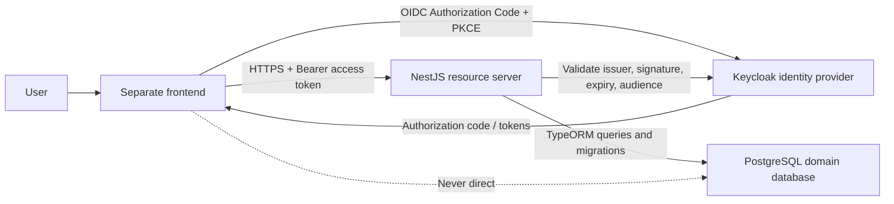
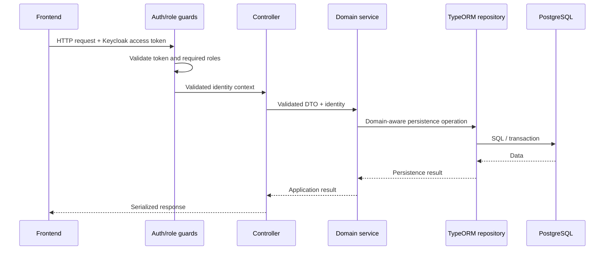

# Architecture

## Status

This document defines the target architecture and distinguishes it from the current
repository. At inspection time, the repository is the default NestJS starter:
NestJS 11, TypeScript, npm, Jest, `@nestjs/testing`, Supertest, ESLint, and Prettier
are present. TypeORM, PostgreSQL integration, Keycloak integration, validation
packages, Docker, migrations, seeds, environment configuration, domain modules, and
the frontend are not yet present.

## System Context



- Keycloak is the identity provider and source of truth for credentials, sessions,
  token issuance, and roles.
- NestJS is the protected resource server and source of truth for business rules,
  domain authorization, REST behavior, application data, audit records, and
  workflows.
- PostgreSQL stores application-domain data.
- TypeORM handles persistence mapping and schema migrations.
- The frontend communicates with NestJS over HTTP and never accesses PostgreSQL.
- Authentication occurs through Keycloak; NestJS implements no local password flow.

## Definitive Stack

- Node.js LTS: exact supported LTS line is `Decision pending`.
- TypeScript and NestJS
- PostgreSQL and TypeORM
- Keycloak, OpenID Connect, OAuth 2.0, and Keycloak-issued JWT access tokens
- `class-validator`, `class-transformer`, and a global `ValidationPipe`
- Docker and Docker Compose
- Jest, `@nestjs/testing`, and Supertest
- A separately deployed graphical frontend: framework and repository are
  `Decision pending`.

TypeORM and Keycloak are definitive choices. The concrete standards-compatible
NestJS library used to validate Keycloak tokens is `Decision pending`.

## Target Backend Layout

```text
src/
├── auth/
│   ├── decorators/
│   ├── guards/
│   ├── interfaces/
│   ├── auth.module.ts
│   └── keycloak.config.ts
├── users/
├── competitors/
├── teams/
├── races/
├── registrations/
├── results/
├── standings/
├── audit/
├── common/
│   ├── decorators/
│   ├── dto/
│   ├── enums/
│   ├── exceptions/
│   ├── filters/
│   ├── guards/
│   ├── interceptors/
│   ├── interfaces/
│   └── pipes/
├── config/
├── database/
│   ├── migrations/
│   ├── seeds/
│   └── typeorm.config.ts
├── app.module.ts
└── main.ts
```

Each domain module should normally follow:

```text
competitors/
├── dto/
│   ├── create-competitor.dto.ts
│   ├── update-competitor.dto.ts
│   └── competitor-query.dto.ts
├── entities/
│   └── competitor.entity.ts
├── repositories/                    # Optional
│   └── competitors.repository.ts
├── competitors.controller.ts
├── competitors.service.ts
└── competitors.module.ts
```

Use `repositories/` only when it encapsulates meaningful behavior. Injecting
TypeORM's `Repository<Entity>` directly is preferred for basic `find`, `findOne`,
`save`, `remove`, and `delete` operations. A wrapper is appropriate for complex
queries, shared criteria, locking, transaction-aware operations, relevant
persistence abstraction, or significantly simpler testing.

## Component Responsibilities

### Controllers

- Receive HTTP requests and parse route, query, and body parameters.
- Invoke application services and return HTTP responses.
- Contain no business logic.
- Do not access TypeORM repositories directly unless a specific, documented reason
  makes the service boundary unnecessary.

### Services

- Contain business rules and coordinate domain operations.
- Enforce state transitions, eligibility, uniqueness, deadlines, and capacity.
- Invoke repositories and coordinate audit events.
- Establish transaction boundaries for operations that must remain consistent.
- Avoid HTTP-specific presentation logic.

### Modules

- Group related capabilities and configure dependency injection.
- Expose only providers required across domain boundaries.
- Avoid broad global modules and unnecessary circular dependencies.
- Use explicit domain services instead of reaching into another module's repository.

### DTOs

- Define API input contracts independently of persistence entities.
- Validate input with `class-validator`.
- Transform known input with `class-transformer` where useful and unambiguous.
- Use NestJS `ValidationPipe` globally with an explicit whitelist/transform policy.
- Do not automatically reuse input DTOs as entities.

For example, an idiomatic positive numeric field uses decorators such as
`@IsNumber()` and `@IsPositive()` after the conversion policy is explicit.
Non-empty strings use `@IsString()` and `@IsNotEmpty()`. Date-in-past/future rules
may require a custom validator; the exact implementation is `Decision pending`.

### Response Models

- Define public response fields deliberately.
- Prevent accidental exposure of internal identifiers, relations, persistence
  metadata, secrets, or Keycloak administration data.
- Use response DTOs or NestJS serialization rules.
- Do not return TypeORM entities directly where doing so can leak internal fields.

### TypeORM Entities

- Represent tables, columns, relationships, constraints, and persistence metadata.
- Contain no route, HTTP-status, token, or credential concerns.
- Do not store anything owned by Keycloak such as passwords, hashes, access tokens,
  refresh tokens, or sessions.
- Keep domain invariants in services when they require repositories, time, actors,
  or cross-aggregate checks.

### Repositories

- Encapsulate database interaction through TypeORM.
- Support complex reads, transactions, and locking when needed.
- Do not contain response formatting or frontend concerns.
- Do not duplicate TypeORM without adding behavior.

### Guards and Decorators

- An authentication guard validates access tokens before any role is trusted.
- A role guard enforces required Keycloak roles.
- A conceptual `@Roles()` decorator declares endpoint role requirements.
- A conceptual `@CurrentUser()` decorator exposes a validated authentication
  context, including `sub`; it does not parse untrusted request fields.
- A public-route decorator may opt a route out of authentication only under an
  explicit default-protected policy.

### Exception Filters

- Produce the uniform error representation in [API contract](api-contract.md).
- Map validation, authentication, authorization, missing-resource, business
  conflict, and internal failures to appropriate HTTP statuses.
- Prevent stack traces and infrastructure details from reaching clients.

### Interceptors

- Handle cross-cutting concerns such as serialization, safe logging, timing, and
  response transformation.
- Redact tokens and secrets.
- Do not replace domain logic or authorization guards.

### Pipes

- Validate and transform incoming route, query, and body values.
- Reject unexpected input according to the adopted compatibility policy.
- Return field-level validation information.
- Do not perform persistence-backed domain decisions that belong in services.

## Request Flow



Domain authorization remains in the service when access depends on the resource,
ownership, state, or other application data rather than only on a global role.

## Database Evolution

- TypeORM migrations are the definitive schema-evolution mechanism.
- `synchronize: true` must not be used in production or as a replacement for
  reviewed migrations.
- Every migration must be reviewed before execution.
- Destructive migrations require an explicit justification, rollout approach, and
  recovery consideration.
- Seeds are separate from migrations.
- Migrations create schema; seeds populate reproducible non-secret domain samples.
- Multi-step writes that must stay consistent use database transactions.
- Concurrency-sensitive operations such as capacity allocation, unique starting
  positions, and official winner assignment require database constraints and/or
  locking. The exact strategy is `Decision pending`.

Migration and seed npm scripts are not currently configured.

## Docker Topology

The required target includes a frontend container, NestJS API container, PostgreSQL
application database, Keycloak container, and persistent Keycloak storage. All
services use explicit environment configuration, an isolated network, practical
health checks, and startup dependencies.

Keycloak storage has two valid target patterns:

1. The PostgreSQL server hosts separate application and Keycloak databases with
   separate credentials.
2. Keycloak uses a dedicated PostgreSQL container.

Selected pattern: `Decision pending`.

Both application and Keycloak data require named persistent volumes. Keycloak's
development-only embedded database is not the production architecture. A realm
import or equivalent reproducible configuration is required. No Docker files exist
yet, so `docker compose up -d --build` is an intended outcome, not a currently
working command.

## Frontend Boundary

- The frontend owns pages, reusable components, user-facing validation, API client,
  authentication session UX, route protection, and screen state.
- It authenticates with Keycloak using Authorization Code Flow with PKCE.
- It sends bearer access tokens to NestJS.
- It shows role-appropriate actions, but backend guards remain authoritative.
- It translates API errors into understandable states.
- It never connects to PostgreSQL or receives server-side client secrets.

## Configuration

Use environment variables through NestJS `ConfigModule` and typed validation when
introduced. Separate development, test, and production configuration. Keep a
non-secret `.env.example`; ignore local `.env` files. Validate required variables at
startup and never log credentials or tokens.

Exact variable names and configuration schema remain `Decision pending`; the
conceptual requirements are documented in [Security](security.md) and the
[README](../README.md).

## Related Documentation

- [Project requirements](project-requirements.md)
- [Business rules](business-rules.md)
- [Database model](database-model.md)
- [API contract](api-contract.md)
- [Security](security.md)
- [Testing](testing.md)
