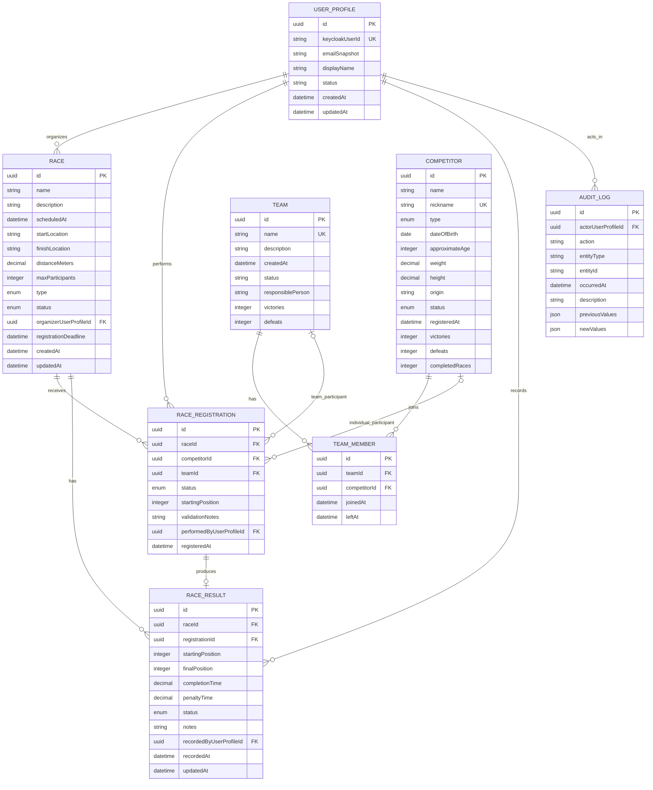

# Database Model

## Ownership Boundary

PostgreSQL stores application-domain data. Keycloak stores identity-system data.
TypeORM is the definitive ORM and TypeORM migrations are the definitive application
schema-evolution mechanism. This is a conceptual model only; no entities or
migrations currently exist.

### Keycloak-Owned Data

Keycloak owns and must not have its data duplicated in the application schema:

- User credentials and password hashes
- Login sessions
- Access and refresh tokens
- Password recovery and account lockout
- Authentication policies and flows
- Realm roles or client roles
- Identity-provider integrations

### Application-Owned Identity Reference

PostgreSQL may contain a `UserProfile` for domain references and audit attribution:

```text
UserProfile
- id
- keycloakUserId
- emailSnapshot
- displayName
- status
- createdAt
- updatedAt
```

- `keycloakUserId` maps to Keycloak's JWT `sub` claim and is unique.
- `keycloakUserId` is the canonical external identity; email is not a stable key.
- `emailSnapshot` is stored only if the domain needs it.
- The profile never stores passwords, hashes, sessions, access tokens, or refresh
  tokens.
- Keycloak remains the owner of identity data even when selected claims are cached.

The need for `emailSnapshot`, profile status values, automatic profile creation, and
claim synchronization is `Decision pending`.

## Roles

Keycloak is the source of truth for `ADMINISTRATOR`, `RACE_ORGANIZER`, and `VIEWER`.
A local role table is not required by the current domain model.

If local role metadata must be retained for academic traceability, the choices are:

1. Keycloak roles only.
2. Local non-authoritative metadata keyed by Keycloak role name.
3. Synchronized role records between Keycloak and PostgreSQL.

Selected approach: `Decision pending`.

No local role duplication may be implemented until source of truth,
synchronization, inconsistency handling, and the stable role identifier are
documented. Backend authorization must always use roles from a validated Keycloak
token.

## Conceptual Entity-Relationship Model



The UUID representation, precision/units for measurements and times, and whether
statistics are stored or derived are `Decision pending`. The diagram's
`USER_PROFILE` links only attribute application actions; they do not make
PostgreSQL the owner of credentials.

## Entity Specifications

### UserProfile

- **Purpose:** correlate a validated Keycloak subject with application records.
- **Main fields/types:** UUID-like `id`; string `keycloakUserId`; nullable string
  `emailSnapshot`; display name; status; timestamps.
- **Relationships:** organizer of races; actor for registrations, results, and
  audit records.
- **Constraints:** unique/non-null `keycloakUserId`; required display name/status
  policy is `Decision pending`.
- **Nullability:** `emailSnapshot` may be null; other optional claim snapshots are
  not defined.
- **Indexes:** unique `keycloakUserId`; optional email index only if a domain query
  requires it.
- **Deletion:** avoid physical deletion while referenced; anonymization/retention is
  `Decision pending`.
- **Audit fields:** `createdAt`, `updatedAt`.
- **Security:** no credentials or tokens; email is a snapshot, not an identifier.
- **Identity owner:** Keycloak.

### Competitor

- **Purpose:** represent an eligible individual racing participant.
- **Main fields/types:** identifier; name; nickname; `CompetitorType`; birth date or
  approximate age; positive decimal weight/height; origin; `CompetitorStatus`;
  registration timestamp; victories, defeats, completed races.
- **Relationships:** team memberships and individual race registrations.
- **Constraints:** unique nickname; non-empty name; positive weight/height; valid
  type/status.
- **Nullability:** either birth date or approximate age is required by the academic
  model, but exact exclusivity is `Decision pending`; team membership is optional.
- **Indexes:** unique nickname; status/type; origin only if filtering requires it.
- **Deletion:** physical deletion only when no official results/history prevents it;
  otherwise retire/deactivate.
- **Audit fields:** creation/update timestamps are recommended but not explicit.
- **Security:** do not expose unintended personal or internal fields.
- **Identity owner:** application domain.

### Team

- **Purpose:** group competitors for team or mixed races.
- **Main fields/types:** identifier; unique name; description; creation date; status;
  coach/responsible person; victories and defeats.
- **Relationships:** has `TeamMember` records and team race registrations.
- **Constraints:** unique name; configurable membership maximum; at least one
  eligible member before race entry.
- **Nullability:** description may be nullable; responsible-person nullability is
  `Decision pending`.
- **Indexes:** unique name and status.
- **Deletion:** deactivate rather than delete when official race history exists.
- **Audit fields:** creation time; update timestamp recommended.
- **Security:** responsible-person data must be minimized.
- **Identity owner:** application domain.

### TeamMember

- **Purpose:** model team membership explicitly and retain history if required.
- **Main fields/types:** identifier, team ID, competitor ID, joined/left timestamps.
- **Relationships:** belongs to one team and one competitor.
- **Constraints:** no duplicate current membership; one active team per competitor.
- **Nullability:** `leftAt` is null while membership is active.
- **Indexes:** `(teamId, competitorId)` and active membership by `competitorId`.
- **Deletion:** closing membership via `leftAt` is recommended for history;
  physical-removal policy is `Decision pending`.
- **Audit fields:** joined/left timestamps.
- **Security:** no identity credentials.
- **Identity owner:** application domain.

### Race

- **Purpose:** represent a scheduled racing event and lifecycle.
- **Main fields/types:** identifier, name, description, scheduled timestamp,
  locations, positive distance, capacity, `RaceType`, `RaceStatus`, organizer,
  deadline, creation/update timestamps.
- **Relationships:** organizer `UserProfile`, registrations, and results.
- **Constraints:** positive distance/capacity; deadline before start; valid status
  and type.
- **Nullability:** description may be nullable; required location policy follows
  the specification's required data.
- **Indexes:** scheduled time, status, registration deadline, organizer.
- **Deletion:** avoid deleting history; cancellation versus deletion rules are
  `Decision pending`.
- **Audit fields:** `createdAt`, `updatedAt`.
- **Security:** organizer references a local profile keyed to Keycloak `sub`.
- **Identity owner:** application domain.

### RaceRegistration

- **Purpose:** bind one eligible individual or team participant to one race.
- **Main fields/types:** identifier, race, exactly one participant reference,
  timestamp, `RegistrationStatus`, starting position, validation notes, actor.
- **Relationships:** race; competitor XOR team; performer `UserProfile`; optional
  result.
- **Constraints:** one participant per race; competitor/team XOR; unique starting
  position within race; eligibility and capacity enforced transactionally.
- **Nullability:** exactly one of `competitorId`/`teamId`; starting position may be
  null before assignment; rejection reason is required when rejected.
- **Indexes:** race/status; unique participant per race; unique race/starting
  position where non-null.
- **Deletion:** cancellation is preferred where history matters; policy is
  `Decision pending`.
- **Audit fields:** registration timestamp and acting user.
- **Security:** actor is resolved from validated `sub`.
- **Identity owner:** application domain.

### RaceResult

- **Purpose:** record the official outcome for an approved registration.
- **Main fields/types:** identifier, race/registration, start/final positions,
  positive completion time, non-negative penalty time, `ResultStatus`, notes,
  recorder, timestamps.
- **Relationships:** race, approved registration, recorder `UserProfile`.
- **Constraints:** one result per race participant; unique normal-finisher position;
  one official winner; disqualified participant cannot win.
- **Nullability:** final position/completion time for non-finish outcomes is
  `Decision pending`; notes may be null.
- **Indexes:** race/status/final position; unique registration result.
- **Deletion:** official result removal/correction policy is `Decision pending`.
- **Audit fields:** recorded/updated timestamps and recorder.
- **Security:** preserve traceability; do not leak unrelated profile claims.
- **Identity owner:** application domain.

### AuditLog

- **Purpose:** provide traceability for important application actions.
- **Main fields/types:** identifier; actor; action; entity type/identifier; timestamp;
  optional description and JSON previous/new values.
- **Relationships:** optional/required actor `UserProfile` depending on system-event
  policy.
- **Constraints:** action/entity/timestamp required; actor nullability for system
  events is `Decision pending`.
- **Nullability:** descriptions and value snapshots are optional.
- **Indexes:** occurred time; actor; `(entityType, entityId)`; action.
- **Deletion:** append-only retention is recommended; definitive retention and
  immutability policy is `Decision pending`.
- **Audit fields:** `occurredAt` is intrinsic; updates should not normally occur.
- **Security:** redact secrets, credentials, tokens, and sensitive claim values.
- **Identity owner:** application audit data; Keycloak still owns authentication
  event details.

## Constraint and Concurrency Notes

Application checks alone are insufficient for race capacity, duplicate registration,
team membership, starting positions, and official finishing positions. Use
PostgreSQL constraints where expressible and transactions/locking where a check and
write must be atomic. Partial unique-index design and transaction isolation are
`Decision pending` until the concrete schema is designed.

## Schema Evolution and Seeds

- Use reviewed TypeORM migrations; never rely on production `synchronize: true`.
- Keep domain seeds separate from migrations.
- Seed the required competitors, teams, races, and completed results reproducibly.
- Provision demo identities and roles through Keycloak realm configuration, not
  PostgreSQL application seeds.
- Do not place real credentials in migrations, seeds, or realm exports.

No migrations or seeds currently exist.
